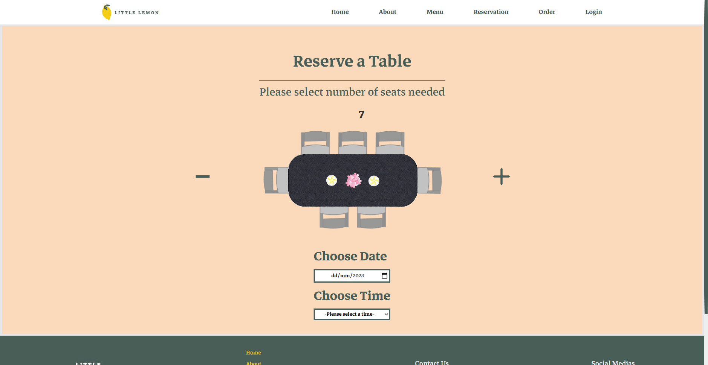

# Little Lemon website

This is a concept website for a resturant named Little Lemon, which included the home page of the site + the reserving a table page

## Table of contents

- [Overview](#overview)
  - [The challenge](#the-challenge)
  - [Screenshot](#screenshot)
  - [Built with](#built-with)
  - [What I learned](#what-i-learned)
  - [Continued development](#continued-development)
  - [Useful resources](#useful-resources)

## Overview

### The challenge

- Build out the project to the designs provided
- Making sure it's fully responsive and works for all screen widths
- Making sure the reserve a table page and forms inside it comply to Ux/Ui design prenciples

### Screenshot

### Built with

- Semantic HTML5 markup
- CSS custom properties
- Tailwind CSS
- Flexbox
- CSS Grid
- Mobile-first workflow
- [React](https://reactjs.org/) - JS library
- [TailwindCss](https://tailwindcss.com/) - CSS framework
- [Form library](https://formik.org/) - For forms
- [Yup library](https://www.npmjs.com/package/yup/) - For form validation
- [Framer Motion library](https://www.framer.com/motion/) - For element animations
- [Figma](https://www.figma.com/) - For designing mockups
